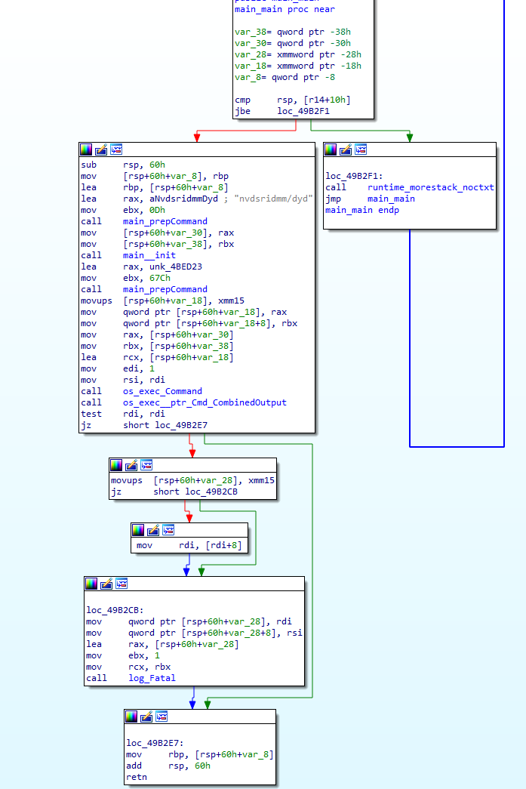
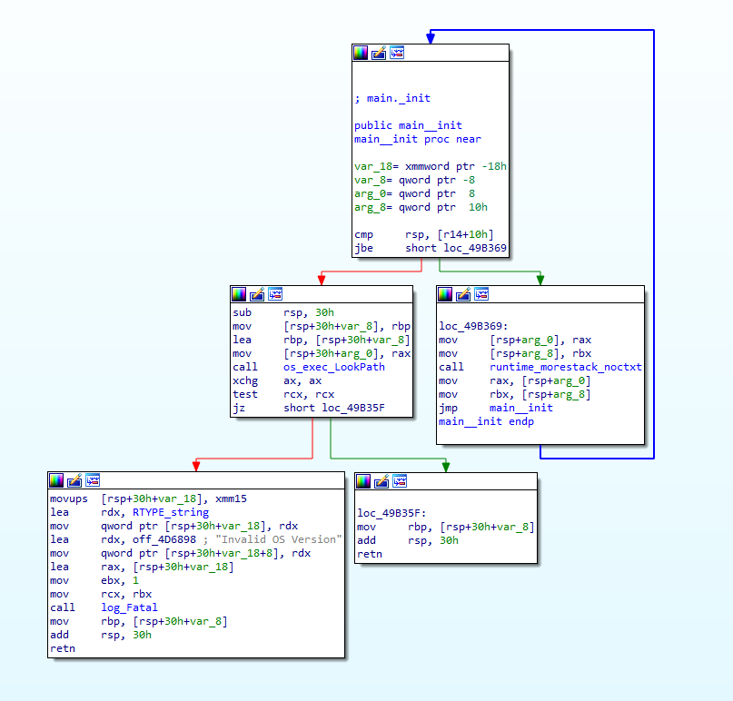
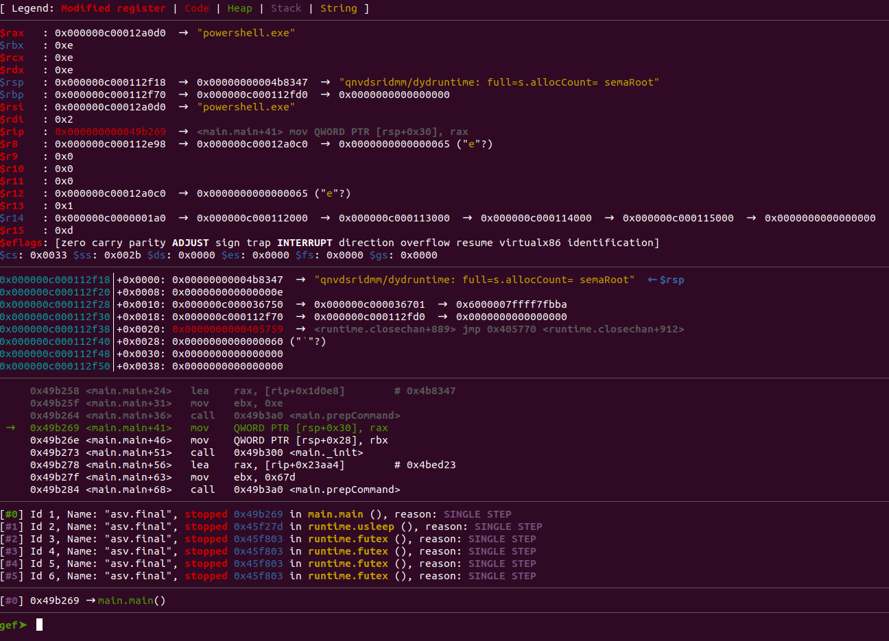
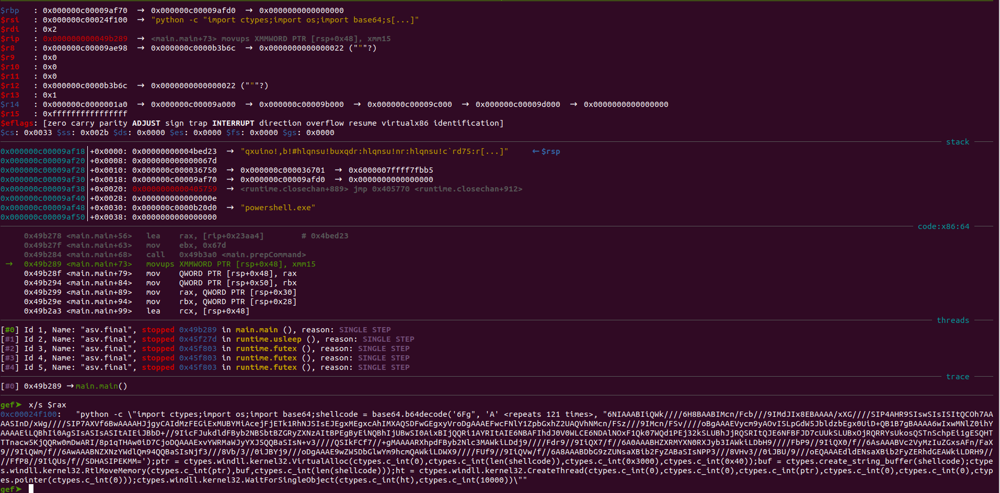
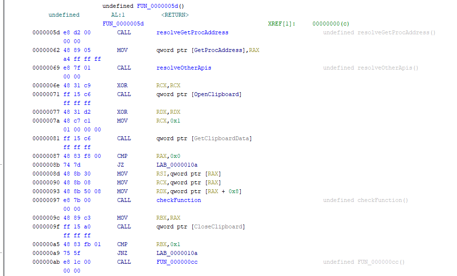
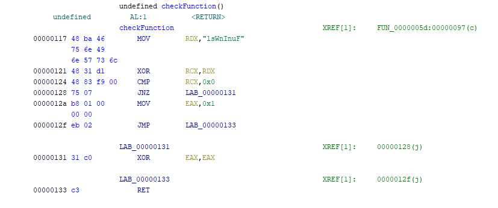
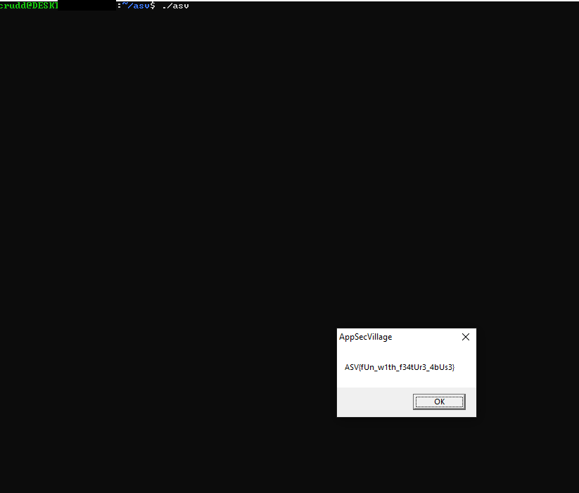

# Unknown file - From AppSec Village CTF^2 at DefCon 30
## Public Challenge Description

This file was found in our development environment. It wouldn't run for us, but maybe you can figure out what it does.

## Initial Analysis - Stage 1
We are given an unknown binary and tasked with figuring out its functionality. Running ```file``` on the binary returns 

```b3b407477c3557950147b7d238c8f252d9a383405ea2601c415b3e863098b615: ELF 64-bit LSB executable, x86-64, version 1 (SYSV), statically linked, Go BuildID=3v-VXC_bD0cZAFARohyF/hKdarif4e97L5uhd7MEB/jOzttNj1LfBqlq1xI9sH/QLqTUam1DJ-dL_POTU8l, not stripped```

Executing the binary only displays the message ```2022/07/04 16:31:39 Invalid OS Version```, so lets take a look at the binary and see what we can find out.

Unfortunately, it is a GoLang binary but luckily for us IDA 7.7 Free has much better GoLang handling than in previous versions. After IDA finishes its analysis, we are taken to the main_main function (the entrypoint in GoLang binaries). The function is small and makes calls to two user-defined functions, ```main_prepCommand``` and ```main_init```. Also of note, is what appears to be two encrypted strings being loaded into ```rax``` before the calls to ```main_prepCommand```.



Following the references from the error message 'Invalid OS Version' in IDAs ```Strings``` window will lead us to the ```main_init``` function. The ```main_init``` function calls ```os_exec_LookPath``` with the return value from the first call to ```main_prepCommand```. ```LookPath``` is a GoLang library function that "searches for an executable named file in the directories named by the PATH environment variable."



Looking at the ```main_prepCommand``` function, we can see the 'encrypted' string is first appended with 'q' and then each character is XORed with 0x01. At this point we could write a script to decode the strings or we could load the file in ```gdb``` and let the program do the work for us.

After loading the binary in ```gdb``` and setting a breakpoint on the first call to ```main_prepCommand```, we run the program and hit our breakpoint. The encrypted string is in ```rax``` and after stepping over the ```main_prepCommand``` function, we can now see the decrypted string in ```rax```.



## Stage 2 - What the WSL
When we ran ```file``` on the binary we saw that it was an 64-bit ELF file, but it is calling ```LookPath``` for ```Powershell.exe```, a Windows executable, and exiting if the file isn't found. WSL allows executing Windows executables from the Linux subsystem. Executing a Windows executable from WSL will switch the context to Windows, allowing Windows APIs to be used. This feature can be used to execute code from the Linux subsystem that takes advantage of the Windows API.

By looking at disassembly of the ```main_init``` function, we can see that the ```test rcx,rcx``` after the call to ```os_exec_LookPath``` can be modified to allow us to continue program execution and decrypt the second encrypted string. We could also ```nop``` out the call to ```main__init``` to skip the function all together, since its only functionality is to check for ```Powershell.exe```. But since we are already in ```gdb```, we can just set ```rcx``` to 0 after the call to ```os_exec_LookPath``` (to do this in ```gdb``` we use the command ```set $rcx = 0```) and then we continue on. After stepping over the second call to ```main_prepCommand``` we can see the second decrypted string.



We can modify the Python command line to write out the shellcode instead of executing it like:

```python -c "import ctypes;import os;import base64;shellcode = base64.b64decode('6FgAAAAAAAAAAAAAAAAAAAAAAAAAAAAAAAAAAAAAAAAAAAAAAAAAAAAAAAAAAAAAAAAAAAAAAAAAAAAAAAAAAAAAAAAAAAAAAAAAAAAAAAAAAAAAAAAAAAAAAAAA6NIAAABIiQWk////6H8BAABIMcn/Fcb///9IMdJIx8EBAAAA/xXG////SIP4AHR9SIswSIsISItQCOh7AAAASInD/xWg////SIP7AXVf6BwAAAAHJjgyCAIdMzFEGiExMUBYMiAcejFjETk1RhNJSIsEJEgxMEgxcAhIMXAQSDFwGEgxyVroDgAAAEFwcFNlY1ZpbGxhZ2UAQVhNMcn/FSz///9IMcn/FSv////oBgAAAEVycm9yAOvISLpGdW5JbldzbEgx0UiD+QB1B7gBAAAA6wIxwMNlZ0ihYAAAAEiLQBhIi0AgSIsASIsASItAIEiJBbD+//9IicFJukdldFByb2NBSbtBZGRyZXNzAItBPEgByEiNQBhIjUBwSI0AixBIjQQRi1AYRItAIE6NBAFIhdJ0V0WLCE6NDAlNOxF1Qk07WQd1PEj32kSLUBhJjRQSRItQJE6NFBFJD7cUUkSLUBxOjRQRRYsUkosQSTnSchpEi1gESQHTTTnacw5KjQQRw0mDwARI/8p1qTHAw0iD7CjoDQAAAExvYWRMaWJyYXJ5QQBaSIsN+v3////QSIkFCf7//+gMAAAARXhpdFByb2Nlc3MAWkiLDdj9////Fdr9//9IiQX7/f//6A0AAABHZXRMYXN0RXJyb3IAWkiLDbH9////FbP9//9IiQX0/f//6AsAAABVc2VyMzIuZGxsAFn/FaX9//9IiQWm/f//6AwAAABNZXNzYWdlQm94QQBaSIsNjf3///8Vb/3//0iJBYj9///oDgAAAE9wZW5DbGlwYm9hcmQAWkiLDWX9////FUf9//9IiQVw/f//6A8AAABDbG9zZUNsaXBib2FyZABaSIsNPP3///8VHv3//0iJBU/9///oEQAAAEdldENsaXBib2FyZERhdGEAWkiLDRH9////FfP8//9IiQUs/f//SDHASIPEKMM=');f=open('shellcode.bin','wb');f.write(shellcode);f.close();"```

The free version of IDA only disassembles PE files (and not shellcode, although we could patch our shellcode into a PE file and load that in IDA), so we'll use Ghidra for this. We could also run the shellcode in the debugger so we can see what is going on using something like ```blobrunner``` (https://github.com/OALabs/BlobRunner) to load the shellcode.



The shellcode is fairly simple. The first call (not shown) is to make some room to store some needed variables (API addresses). The next two calls resolve GetProcAddress and the other APIs needed by the binary. Next, the clipboard is read and the contents is passed to the next function (labeled ```checkFunction``` in the image) that checks if the clipboard contains the string 'FunInWsl'.



If the clipboard does not contain 'FunInWsl' then an 'error' MessageBox is displayed. If the clipboard contains 'FunInWsl' then the binary uses that to decrypt the flag and displays it in a MessageBox.

Flag: ASV{fUn_w1th_f34tUr3_4bUs3}

